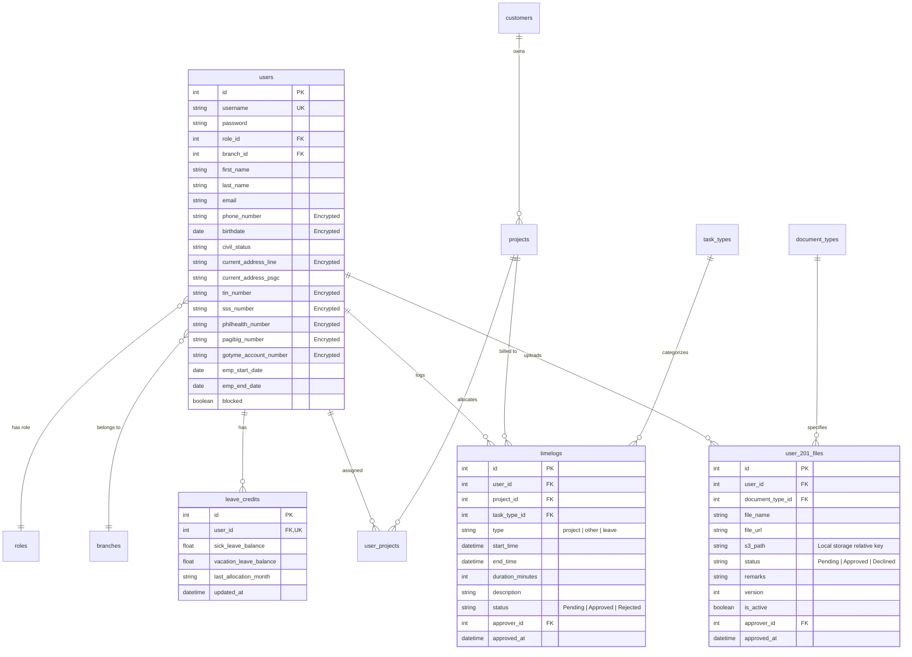

# Sialdang Timelogs — Complete System Documentation & Process Manual

---

## 1. Executive Summary & System Overview

**Sialdang Timelogs** is an enterprise-grade time-tracking, project allocation, leave credit management, and HR employee compliance (201 Files) platform designed for Philippine operations.

### Key Highlights
- **Role-Based Workflows**: Tailored permissions for `Admin`, `Manager`, and `User` (Staff).
- **Interactive Weekly Task Calendar**: 30-minute block precision, visual drag-to-select time logging, conflict-detection, contract-boundary blocking, and live hour calculations.
- **Automated Leave Credits System**: Automated monthly accruals for Sick and Vacation leaves, rule-based deductions based on logged duration, automatic refunding on rejected/deleted leaves, and annual resets.
- **Philippine 201 Files HR Compliance**: Multi-category file management (Pre-employment, Payroll, Government IDs), multi-step upload with temporary quarantine, versioning, and administrative approval/rejection with remarks.
- **Client & Project Billing**: Hierarchical Customer → Project → User Resource assignment with Full-Time Equivalent (FTE) tracking.
- **Local Storage Architecture**: Decoupled from third-party cloud services (AWS S3, AWS Secrets Manager, Amplify), utilizing secure local static directories (`static/uploads/`) and self-hosted MySQL.
- **Security & Privacy**: Field-level symmetric encryption (Fernet AES-128-CBC + HMAC) for sensitive personal information (TIN, SSS, PhilHealth, Pag-IBIG, bank details, addresses), hashed passwords (Argon2 / Bcrypt), and JWT-based authentication.

---

## 2. Technology Stack & Local Architecture

### Frontend
- **Framework**: SvelteKit 2 + Svelte 5 (Runes and reactive syntax)
- **Styling**: TailwindCSS v4 with dark/light theme switching
- **Icons**: Iconify (`@iconify/svelte`, `@iconify-json/mdi`, `@iconify-json/heroicons-solid`)
- **Address System**: `@jobuntux/psgc` (Philippine Standard Geographic Code engine for Province → City/Municipality → Barangay resolution)
- **Reporting & Export**: SheetJS (`xlsx`) for client-side Excel workbook generation
- **Build Tool**: Vite 7 with development proxy to backend (`/api` → `http://localhost:8000`)
- **Hosting Adapter**: `@sveltejs/adapter-auto`

### Backend
- **Framework**: FastAPI (Python 3.14+)
- **Server**: Uvicorn with async ASGI workers
- **ORM & Database Driver**: SQLAlchemy 2 (asyncio) + `aiomysql` + `greenlet`
- **Database Engine**: MySQL 8.x (Laragon / localhost:3306)
- **Authentication**: JWT (JSON Web Tokens) via `python-jose` with bearer token authentication
- **Encryption**: Cryptography library (`Fernet`) for sensitive database columns
- **File Storage**: Local directory (`backend/static/uploads/`) mounted at `/static`

---

## 3. User Roles & Permission Matrix

| Feature / Page | User (Staff) | Manager | Admin |
| :--- | :---: | :---: | :---: |
| **Login & Dashboard** (`/login`, `/main`) | ✅ | ✅ | ✅ |
| **Personal Task Calendar** (`/tasks`) | ✅ (Own logs) | ✅ (Own logs) | ✅ (Own logs) |
| **Personal Profile & 201 Uploads** (`/profile`) | ✅ (Own profile) | ✅ (Own profile) | ✅ (Full edit) |
| **Leave Balances** (`/my-leaves`, `/profile`) | ✅ (Own balance) | ✅ (Own balance) | ✅ (All users) |
| **Approval Center** (`/approval`) | ❌ | ✅ (Assigned projects) | ✅ (All projects & timelogs) |
| **201 Files Repository** (`/201-files`) | ❌ | ❌ | ✅ (Full review & approve) |
| **User Management** (`/users`) | ❌ | ❌ | ✅ (Create, edit, lock, reset) |
| **Customers & Projects** (`/customers`) | ❌ | ❌ | ✅ (Full CRUD & resource FTE) |
| **Locations / Branches** (`/locations`) | ❌ | ❌ | ✅ (Create & edit branches) |
| **My Reports** (`/my-reports`) | ✅ (Own logs) | ✅ (Own logs) | ✅ (All company logs & export) |
| **System Options** (Salutations, Dept, etc.) | ❌ | ❌ | ✅ |

### Account Lifecycle & Access Enforcement
1. **Contract Date Check**: Every user has an `emp_start_date` and `emp_end_date`.
   - **Contract Not Started**: If current date is prior to `emp_start_date`, login is rejected with `"CONTRACT NOT STARTED — Contact admin"`.
   - **Contract Ended**: If current date is past `emp_end_date`, login is rejected with `"CONTRACT ENDED — Contact admin"`.
2. **Administrative Lock (Blocked)**:
   - Admin can toggle the `blocked` status in `/users`.
   - Blocked accounts are immediately denied login with `"ACCOUNT BLOCKED — Contact admin"`.
   - Blocked accounts are automatically excluded from monthly leave credit allocations.

---

## 4. Detailed Core Workflows

### 4.1. Timelog & Interactive Calendar System

The Task Calendar (`/tasks`) provides an intuitive visual schedule for logging daily activities.

#### Calendar Layout & Controls
- **Date Navigation**: Previous Week, Next Week, Today selector, and URL query parameter tracking (`?weekStart=YYYY-MM-DD`).
- **View Modes**:
  - **8–6 View**: Displays the standard 10-hour working day (8:00 AM to 6:00 PM).
  - **12h View**: Expands the display to 7:00 AM to 7:00 PM or full 24h scrollable area.
- **Granularity**: 30-minute time slots (00 and 30).
- **Day Ordering**: Sunday-first or Monday-first display.

#### Timelog Types
1. **Project Entry (`type = 'project'`)**:
   - Must be associated with an active `project_id`.
   - User must be assigned as a resource to the project.
   - Used for client-billable and project-specific hours.
2. **Other Tasks (`type = 'other'`)**:
   - Internal operational activities not billed to a client:
     - *Training*
     - *HR Task*
     - *IT Task*
     - *Admin Task*
     - *Delivery Assurance*
3. **Leave & Holidays (`type = 'leave'`)**:
   - Time-off entries:
     - *Sick Leave*
     - *Vacation Leave*
     - *Holidays*
     - *Absent Without Office Leave*
   - Automatically connected to the Leave Credit deduction engine.

#### Calendar Blocking Mechanics
The calendar enforces data integrity through three blocking layers:
1. **Contract Boundary Blocking**:
   - The user's contract start (`emp_start_date`) and end (`emp_end_date`) dates are verified.
   - Any day column outside this window is rendered with a grey diagonal stripe or darkened overlay and marked as `blocked`.
   - Users cannot click or drag on blocked days.
2. **Overlap Conflict Blocking**:
   - Before allowing a selection, `isTileReallyBlocked()` checks for existing timelogs covering that time window on that day.
   - Overlapping tiles cannot be clicked or dragged over, preventing double-logging hours for the same time slot.
3. **Drag Clamping**:
   - When click-and-dragging across slots, the selection is dynamically clamped via `clampToUnblockedRange()`, automatically stopping if the user's cursor crosses an existing timelog or contract boundary.

#### Total Hours & Billing Computation
- **Daily Totals**: Displayed at the header of each day column (`X.XX hrs`).
- **Weekly Total**: Summed at the top bar (`X.XX hrs`).
- **Leave Exclusion**: `leave` entries are displayed visually with assigned colors, but their hours are excluded from regular working/task totals to prevent inflating actual worked hours.

#### Timelog Approval Lifecycle
1. User logs entry → Status: **Pending**.
2. Manager or Admin reviews entry in `/approval`.
3. If **Approved**:
   - Status updated to `Approved`, `approver_id` and `approved_at` recorded.
   - System notification sent to the employee.
   - *Approved entries cannot be deleted by users* (must be rejected by manager/admin first).
4. If **Rejected**:
   - Approver enters reason/remarks.
   - Notification sent to employee.
   - If entry was a Sick or Vacation leave, any deducted leave points are automatically refunded.

---

### 4.2. Leave Credits Engine (Sick & Vacation Leaves)

The system features an automated, rule-based leave accounting engine (`app/api/leave_credits.py` and `app/api/timelogs.py`).

#### Leave Credit Accrual (Earning Points)
- **Default Allocation**:
  - **+1.0 point** Sick Leave balance per month.
  - **+1.0 point** Vacation Leave balance per month.
- **Accrual Logic**:
  - Tracked per employee via `last_allocation_month` (`YYYY-MM`).
  - **Automatic Accrual**: Triggered automatically when the user or administrator views leave credits in `/profile`, `/tasks`, or `/my-leaves`. If `last_allocation_month != current_month` and the user's contract is active, +1.0 sick and +1.0 vacation points are added, and `last_allocation_month` updates to the current month.
  - **Batch Allocation**: Admins can run `POST /leave-credits/allocate-monthly` to allocate credits to all unblocked, active employees in bulk.
  - Inactive (contract not started or ended) and blocked users are skipped.

#### Leave Credit Deduction Rules
When a user logs a `leave` timelog with a task type containing "sick" or "vacation", points are deducted based on duration:

$$\text{Duration} \ge 420\text{ mins (7.0+ hours)} \implies \mathbf{1.0\text{ point deducted (Full Day)}}$$

$$210\text{ mins} \le \text{Duration} < 420\text{ mins (3.5 to <7.0 hours)} \implies \mathbf{0.5\text{ points deducted (Half Day)}}$$

$$\text{Duration} < 210\text{ mins (<3.5 hours)} \implies \mathbf{0.0\text{ points deducted}}$$

#### Reversal & Refund Rules
- **Rejection Refund**: If an admin or manager rejects a pending or approved leave entry in `/approval`, the exact points deducted (1.0 or 0.5) are immediately credited back to the user's balance.
- **Deletion Refund**: If a pending leave entry is deleted by the employee, the deducted points are refunded back to their balance.
- **Re-approval**: If a previously rejected leave is changed back to Pending or Approved, the points are re-deducted.

#### Yearly Reset
- Standard Philippine HR policy requires yearly rollover or clearing of unused leaves.
- Admin triggers `POST /leave-credits/reset-yearly`:
  - Sets `sick_leave_balance = 0.0`
  - Sets `vacation_leave_balance = 0.0`
  - Clears `last_allocation_month` for a clean slate in the new year.

---

### 4.3. Branches / Locations Management

The **Locations** module (`/locations`) defines physical office branches across the organization.

#### Workflow
1. **Creation**:
   - Admin navigates to `/locations` and clicks **Add Location**.
   - Specifies **Location Name** (e.g., *Head Office - Pasig*, *Cebu Branch*, *Davao Hub*) and **Address**.
   - Record stored in `branches` table with timestamp.
2. **Employee Assignment**:
   - In `/users`, Admin assigns each employee to their home branch via `branch_id`.
   - Branch association is reflected in the user profile, reports, and administrative filters.
3. **Editing & Updates**:
   - Admins can update branch addresses and names; changes propagate across all linked user profiles and reporting summaries.

---

### 4.4. Customers & Projects Management

The **Customers & Projects** module (`/customers`) handles clients, deliverables, and resource capacity planning.

#### Structure: Customer → Project → Resources
1. **Customers**:
   - Admin creates a client company with name, full country selection (standard international list), status (`Active` or `Inactive`), and contact details.
2. **Projects**:
   - Created under a selected Customer.
   - Fields:
     - **Project Name** & **Project Code** (e.g., `PRJ-CORP-001`).
     - **Start Date** & **End Date**.
     - **Status**: `Active`, `Completed`, `On Hold`, or `Cancelled`.
     - **Color Tag**: Hex color used to identify the project on employee calendars.
     - **Branch Association**: Links the project to a specific branch location.
3. **Resource Allocation (FTE)**:
   - Admins assign specific employees to each project.
   - **Full-Time Equivalent (FTE)** selection:
     - `1.0 FTE` (100% full-time commitment)
     - `0.75 FTE` (75% commitment)
     - `0.50 FTE` (Half-time commitment)
     - `0.25 FTE` (Quarter-time commitment)
     - `0.0 FTE` (Ad-hoc / on-call)
   - Only projects where an employee is assigned appear in their task calendar project selection list.

---

### 4.5. HR 201 Files Management

A **201 File** is the mandatory Philippine personnel record storing all legal, pre-employment, and statutory documents for an employee.

#### Document Categories
1. **Pre-employment Documents**:
   - `PSA`: PSA Birth Certificate (Required)
   - `NBI`: NBI Clearance for Local Employment (Required)
   - `POLICE`: Police Clearance (Required)
   - `MEDCERT`: Medical Certificate / Fit to Work (Required)
   - `TOR_SO`: Transcript of Records with Special Order number (Required)
   - `MARR_CERT`: Marriage Certificate (Optional if married)
2. **Payroll Documents**:
   - `GOTYME_CERT`: GoTyme Bank Certificate (Required)
   - `ATM_CARD`: GoTyme ATM Card photo (Required)
3. **Government Statutory Documents**:
   - `TIN`: Tax Identification Number verification (Required)
   - `SSS`: Social Security System document (Required)
   - `PHILHEALTH`: PhilHealth document (Required)
   - `PAGIBIG`: Pag-IBIG Fund document (Required)
4. **Miscellaneous**:
   - General certifications, trainings, and employment addenda.

#### Technical Upload & Approval Pipeline
1. **Validation**:
   - Allowed MIME types: `application/pdf`, `image/png`, `image/jpeg`, `image/jpg`, `image/img`.
   - Size limit: 10 MB per file.
2. **Temporary Local Staging**:
   - Employee uploads document via `/profile`.
   - File is initially saved to temporary quarantine:
     `backend/static/uploads/temp/{user_id}/{timestamp}-{clean_filename}`
   - `user_201_files` database record created with `status = "Pending"` and `is_active = True`.
   - If a previous file existed for that document type, the older record has `is_active` set to `False` (version increment).
3. **Review & Approval**:
   - Admin accesses `/201-files` or `/approval`.
   - Admin can preview PDF or images in the inline modal or download the file.
4. **Permanent Migration**:
   - When Admin clicks **Approve**:
     - Subfolder determined by document category (`pre-employment`, `payroll`, `government`, `misc`).
     - File is moved out of quarantine to permanent storage:
       `backend/static/uploads/201-files/{Employee_Name}/{Category}/{timestamp}-{filename}`
     - The file name is standardized: `<Document Name> - <Employee Name>.<ext>`
     - DB record updated with new permanent URL, `status = "Approved"`, `approver_id`, and `approved_at`.
5. **Decline Workflow**:
   - If Admin clicks **Decline**, a remarks dialog prompts for the reason (e.g., *"Blurry scan"*, *"Expired NBI clearance"*).
   - Status updated to `Declined`.
   - Employee receives notification and badge in `/profile` to re-upload.

---

## 5. Comprehensive Page-by-Page Functional Guide

### 1. `/login` (Authentication)
- Clean, responsive login portal with username and password inputs.
- Show/Hide password toggle.
- Validates active contract dates and administrative block state.
- Stores JWT bearer token and user metadata in reactive stores and browser local storage.

### 2. `/setup` (Initial Admin Setup)
- Dedicated initialization wizard that activates only when 0 users exist in the database.
- Prompts for root administrator credentials, contact information, and initial branch.
- Once completed, automatically locks to prevent re-initialization.

### 3. `/main` (Executive Dashboard)
- Post-login home screen providing role-tailored high-level metrics.
- Visual summary cards: Weekly logged hours, upcoming leave balances, pending approvals counter, and quick navigation buttons to calendar, profile, and reports.

### 4. `/tasks` (Task Calendar)
- Full interactive time-logging grid.
- **Sidebar**:
  - **Notes Section**: Guidelines for time logging, break policies, and contact information:
    - Contact email: `arieskingnieto@gmail.com`
  - **Active Projects Accordion**: Displays all projects logged this week with assigned colors and total hours.
  - **Other Tasks Accordion**: Summary of non-project activities logged this week.
  - **Leaves Accordion**: Summary of leave and holiday entries.
- **Action Modal**:
  - Triggered by clicking or drag-selecting time slots.
  - Allows selecting Task Type, Project, Category, Start Time, End Time, and Description.
  - Features real-time leave credit preview (e.g., *"Current balance: 5.0 → After deduction: 4.0"*).
  - Quick action buttons: **Save**, **Duplicate**, **Delete**.

### 5. `/profile` & `/profile/[id]` (Employee Profile & 201 Filing)
- **Dual Tab Interface**:
  - **Personal Tab**:
    - Avatar and account role badge.
    - Editable contact numbers, email, civil status, birthdate, and emergency contacts.
    - **Philippine Standard Geographic Code (PSGC)** address selectors:
      - Province dropdown → Automatically loads corresponding Municipalities/Cities → Automatically loads Barangays.
      - 10-digit PSGC code stored for spatial consistency.
    - Government statutory numbers (TIN, SSS, PhilHealth, Pag-IBIG).
    - GoTyme bank account details.
  - **Employment & 201 Files Tab**:
    - Job level, Department, Salutation, Branch location, Contract dates.
    - **Leave Credit Cards**: Real-time display of Sick Leave balance and Vacation Leave balance.
    - **201 File Sections**: Pre-employment, Payroll, Government, and Miscellaneous document upload dropzones with real-time status badges (`Pending`, `Approved`, `Declined`), view modal, and re-upload capability.

### 6. `/201-files` (HR 201 Document Vault)
- Restricted to Administrators.
- Comprehensive table listing all uploaded documents across all employees.
- Filters: Employee search, Document Category, Document Type, Status (`Pending`, `Approved`, `Declined`), and Date uploaded.
- Direct inline file viewer modal for PDF and image inspections.
- Bulk approval and individual approval/decline buttons with remarks input.

### 7. `/approval` (Manager & Admin Approval Center)
- Central clearinghouse for all pending submissions.
- Filter by submission type: **Timelogs** or **201 Files**.
- Filter by Project, Task Type, Status (`Pending`, `Approved`, `Rejected`), and Date Range.
- Managers see entries for projects they manage; Admins see all organization entries.
- One-click approval or rejection with mandatory remarks dialog.
- Emits real-time in-app notifications to submitters upon decision.

### 8. `/users` (Employee Master Management)
- Restricted to Administrators.
- Paginated table of all registered accounts with role filters, status filters, and search by name/username/email.
- **Action Capabilities**:
  - **Add User**: Create new employee with credentials, contract start/end dates, role, and branch.
  - **Edit User**: Modify roles, department, job level, contact data.
  - **Reset Password**: Generate a new secure password for the user.
  - **Lock/Unlock Account (`mdi:lock`)**: Immediately block or unblock user access.
  - **View Credits**: Inspect current leave credit balances.

### 9. `/customers` (Clients & Project Portfolio)
- Dual-panel interface:
  - **Left Panel (Customers)**: Create and edit clients, search by name, filter by country.
  - **Right Panel (Projects)**: View projects under selected client, create new projects with color tags, code, branch, and date bounds.
- **Project Resources Sub-panel**:
  - Assign staff to projects.
  - Set FTE commitments (0.0 to 1.0).
  - Remove or reassign project team members.

### 10. `/locations` (Branch Locations)
- Company office registry.
- Create new physical office branches with street address and city.
- Serves as the foreign key foundation for employee branch assignments and localized project tracking.

### 11. `/my-reports` (Analytics & Excel Export)
- Comprehensive audit and reporting engine.
- Filters: Date range (From / To), Project, Approver, and Employee (privileged users).
- Real-time calculations: Total Minutes, Total Billable Hours, Project breakdown.
- **Export to Excel**: Generates formatted `.xlsx` spreadsheets complete with Employee Name, Date, Project, Start Time, End Time, Duration, Status, and Approver details.

### 12. `/my-leaves` & `/team-leaves` (Leave Schedules)
- Visual calendars highlighting planned leaves, sick absences, vacation leaves, and official company holidays.
- Team view allows managers to identify overlapping absences to ensure project coverage.

### 13. `/notifications` (System Alerts)
- Bell icon dropdown in main navigation and dedicated `/notifications` management page.
- Tracks:
  - Timelog approvals and rejections (with reviewer name and remarks).
  - 201 file approvals and decline remarks.
- Deep links: Clicking an alert navigates directly to the relevant entry or calendar week with highlight animation.
- Mark individual or all notifications as read.

### 14. `/about`
- Application versioning, release changelog, and organizational support details.

---

## 6. Database Schema & Field Encryption Reference

### Key Tables Architecture



### Field-Level Encryption Details
In compliance with data privacy regulations (such as the Philippine Data Privacy Act of 2012), sensitive personal employee records are encrypted at rest in MySQL using SQLAlchemy custom `TypeDecorator` (`EncryptedString` in `app/utils/encryption.py`) with Fernet:
- `phone_number`
- `birthdate`
- `permanent_address_line`
- `current_address_line`
- `emergency_contact_name`
- `emergency_contact_number`
- `gotyme_account_name`
- `gotyme_account_number`
- `tin_number`
- `sss_number`
- `philhealth_number`
- `pagibig_number`

Decryption occurs transparently on the API layer for authenticated authorized callers.

---

## 7. Local Operational Runbook

### Starting Both Services
Use the PowerShell script located at the project root:
```powershell
.\run_local.ps1
```
This automatically launches:
1. **Backend**: `http://localhost:8000` (FastAPI + Uvicorn)
2. **Frontend**: `http://localhost:5173` (Vite dev server)

### Independent Service Control
```powershell
# Run Backend Only
cd backend
.\venv\Scripts\python.exe main.py

# Run Frontend Only
cd Frontend
npm run dev
```

### Environment Configuration (`backend/.env`)
```ini
DB_HOST=127.0.0.1
DB_PORT=3306
DATABASE=timelogs
DB_USER=root
DB_PASSWORD=
JWT_SECRET_KEY=583bfef8e73e22734dbca84b32be39c73e882ec2b30abed9ff068e46eecc4f6b
USER_DATA_ENCRYPTION_KEY=tT6fNsFAamDadZrleUOR1gXe_LQ5vNEhYMWZjt-EnuM=
DEFAULT_TIMEZONE=Asia/Manila
```

### Default Administrative Credentials
- **Username**: `admin`
- **Password**: `AdminPassword123!`
- **Role**: `admin`

---
*Document Version: 1.0.0*  
*Last Updated: September 2026*  
*Contact & Support*: `arieskingnieto@gmail.com`
